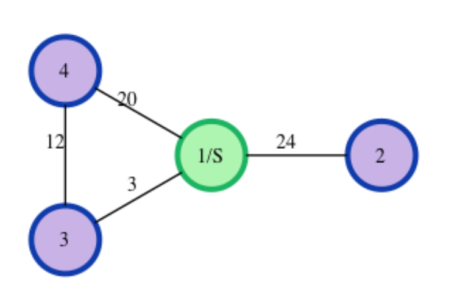

# Algoritmusok és Adatszerkezetek I. - Gyakorlat

## Elérhető feladatok:
### [1. feladat - Missing number](https://github.com/DeakEva/Algoritmusok/raw/main/teszt.py)
**Feladat leírása:** 
Adott két szám tömbje, keressük meg, hogy a második tömb mely elemei hiányoznak az első tömbből.
Ha egy szám többször előfordul a listákban, akkor gondoskodni kell arról, hogy a szám mindkét listában legyen. Ha ez nem így van, akkor is hiányzó szám.

**Kikötések**
- Csak egyszer adjon meg egy hiányzó számot, még akkor is, ha többször hiányzik.
- Az eredeti lista maximális és minimális száma közötti különbség kisebb vagy egyenlő, mint 100.
- Hiányzó számok növekvő sorrendben térjenek vissza
- 1 <= n
- m <= 2*105
- n <= ma
- 1 <= brr[m] <= 104
- max(brr) - min(brr) <= 100

**Függvény működése:** 
Bemenet:
- **int[n]**: egész számok, ahol az *"n"* a lista méretét jelöli
- **int[m]**: egész számok, ahol az *"m"* a lista méretét jelöli

Kimenet:
- **int[]**: egész számomat tartalmazó tömb

**Példa bement:**
- **arr[n]**: n darab szóközzel elválasztott, hiányzó számokat tartalmazó tömb arr = [7,2,5,3,5,3]
- **brr[m]**: m darab szóközzel elválasztott, eredeti számokat tartalmazó tömb brr = [7,2,5,4,6,3,5,3]

**Elvárt kimenet:** 
- [4,6] számo(ka)t tartalmazó tömb

### [2. feladat - Power sum](https://github.com/)
**Feladat leírása:** 
Határozzuk meg, hogy egy adott egész szám hányféleképpen fejezhető ki egyedi, természetes számok **Np**-edik hatványainak összegeként

**Kikötések**
- 1 <= X <= 1000
- 2 <= N <= 10

**Függvény működése:** 
Bemenet:
- **X**: összegszám
- **N**: hatványkitevő, amire a számokat emelni kell

Kimenet:
- **int**: az összes lehetséges kombinációt tartalmazó **egész** szám

**1) Példa bement:**
- **X**: 10
- **N**: 2

**Elvárt kimenet:** 
- 1
- Magyarázat: 10 = 12 + 32

**2) Példa bement:**
- **X**: 100
- **N**: 2

**Elvárt kimenet:** 
- 3
- Magyarázat: 100 = (102) = (62 + 82) = (12 + 32 +4 2 +5 2 +72)

### [3. feladat - Fibonacci sequence](https://github.com/)
**Feladat leírása:** 
Implementáljunk egy módosított **Fibonacci** sorozatot a következőek szerint: 
- Legyen adott t[i] és t[i+1], ahol i ∈ (1, +∞) és t[i+2] a következő szerint számítható ki:
ti+2 = ti + (ti+1)2

**Kikötések**
- 0 <= t1, t2 <= 2
- 3 <= n <= 20
- tn lehetséges, hogy 64-bitnél is nagyobb szám lesz

**Függvény működése:** 
Bemenet:
- **t1**: egész szám
- **t2**: egész szám
- **n**: egész szám, iterációk száma

Kimenet:
- **int**: az **n**-edik szám az iterációban

**Példa bement:**
- **t1**: 0
- **t2**: 1
- **n**: 5

**Elvárt kimenet:** 
- 5
- Magyarázat: amennyiben t1 = 0 és t2 = 1, akkor a módosított **Fibonacci** sorozat a következő(k) szerint alakul: {0, 1, 1, 2, 5, 27, ...} az N-edik helyen lévő érték, így az **5** lesz

### [4. feladat - Dijkstra](https://github.com/)
**Feladat leírása:** 
Legyen adott egy irányítatlan gráf és egy kezdő csomópont. Határozzuk meg a kezdő csomóponttól a gráf összes többi csomópontjáig vezető legrövidebb utak hosszát. Ha egy csomópont nem érhető el, akkor a távolsága legyen -1. A csomópontok számozása 1-től n-ig történik a csomópontok közötti távolságok pedig különböző hosszúak.

**Kikötések**
- 1<= t <= 100
- 2 <= n <= 3000
- 1 <= m <=  N*(N-1)&frasl;2
- 0 <= x, y, s <= N
- 1 <= r <= 105
- Ha ugyanazon csomópont párok között több különböző súlyú él is fut, akkor úgy kell venni, mintha több él lenne

**Függvény működése:** 
Bemenet:
- **t**: tesztesetek száma
- **n**: egész szám, csomópontok száma
- **m**: egész szám, élek száma
- **[x, y, r]**: egész számok, élekhez tartozó információ, ahol az **x** a indulási csomópont, **y** az érkezési csomópont, **d** pedig az élnek a hossza
- **s**: indulási csomópont

Kimenet:
- **int**: egész szám, ahol a növekvő sorrendben rendezett csomópontokhoz tartozó legrövidebb út vezet, **egész** szám 

**Példa bement:**
- **t**: 1
- **n**: 4
- **m**: 4
**[x, y, r]**: 
1 2 24 
1 4 20 
3 1 3 
4 3 12 
- **s**: 1

**Elvárt kimenet:** 
- 24 3 15

**Magyarázat:**

- **1/S** csúcsponttól a **2**-es csúcspontban a legrövidebb út hossza: **24**
- **1/S** csúcsponttól a **3**-as csúcspontban a legrövidebb út hossza: **3**
- **1/S** csúcsponttól a **4**-es csúcspontban a legrövidebb út hossza: **15**

### Algoritmusok és Adatszerkezetek I. - Kollokvium feladat 
Nemes Tihamér versenyfeladat
Feladat leírása: (https://mester.inf.elte.hu:8181/faces/leiras.xhtml?jfwid=99e6a65c6c28a998de8377a8e05d:21) 

### Problémamegoldó szeminárium OKTV feladat
Gyémántok
Feladat leírása: (https://mester.inf.elte.hu:8181/faces/leiras.xhtml?jfwid=99e6a65c6c28a998de8377a8e05d:10)

# Készítette
- Deák Éva - JNGAXV
- rövidciklusú digitális kultúra tanári szak
